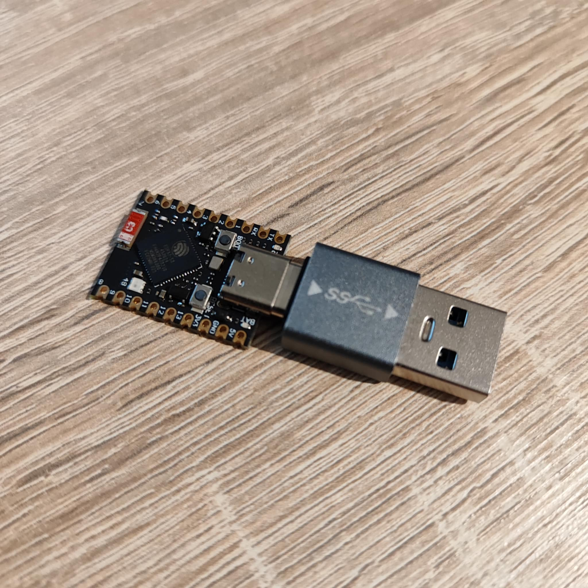
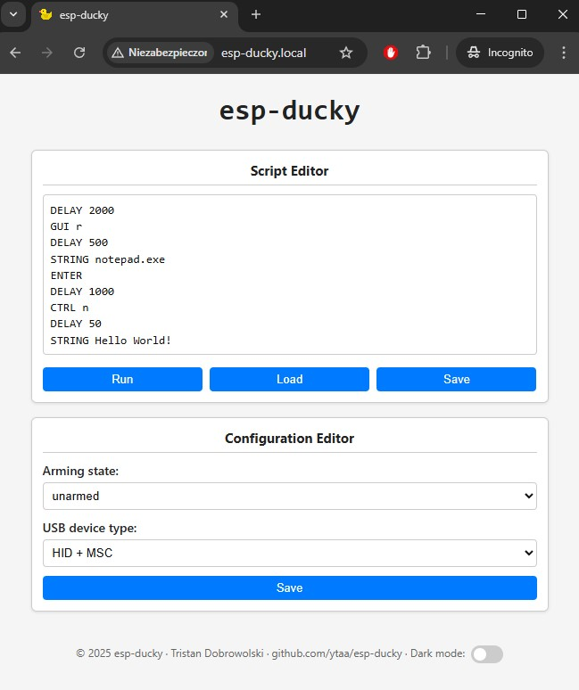

# esp-ducky
A BadUSB device based on ESP32 SoC and ESP-IDF framework, capable of running basic DuckyScript payload. 

The device emulates a keyboard (USB Human Interface Device - HID) and once plugged into a computer, it automatically initiates a series of keystrokes based on the stored DuckyScript payload. 

Additionally, the device can be configured to be recognized as a USB Mass Storage Class device (USB MSC), which allows it to be perceived as a regular USB flash drive. It allows storage of user data, utilizing the builtin ESP32 SPI flash memory. 

## Hardware

To goal of the project was to create a BadUSB device that works out of the box, without any HW modifications. It is possible thanks to the USB-OTG support added to some ESP32 SoCs. 

The project should be functional on any ESP32 SoC with USB-OTG support and >4MB of SPI flash memory. It was tested to work correctly on ESP32-S3, but it should work on ESP32-S2 as well. 

Example deployments:

- ESP32-S3 Super Mini with a USB3.0 to Type-C Male Adapter
<br />

## Web Interface

The DuckyScript payload storage and the device configuration is possible through a web interface provided by the device:
<br />

Access to the web interface is possible once connected to the WiFi Access Point provided by the device (the default credentials can be modified in the EspDucky class definition):
- SSID: *esp-ducky*
- Password: *ducky123*

After connecting to the AP, the web interface is accessible with mDNS URL http://esp-ducky.local/ or IP address http://192.168.4.1/

### Script Editor
The *Script Editor* section enables modification of the DuckyScript payload. It contains a modifiable text area which on load is filled with the currently stored DuckyScript payload. Additionally, it contains multiple buttons:
- *Run* - Once pressed, the current content of the *Script Editor* text area is executed. The execution is only possible if the USB HID device is enabled and mounted to a USB host. 
- *Load* - Once pressed, the current content of the *Script Editor* text area is filled with the currently stored DuckyScript payload.
- *Save* - Once pressed, the current content of the *Script Editor* text area is stored on the device for future execution (see [configuration of arming state](#arming-state)). For efficiency, the script is not stored as a plain text. It is stored in a "compiled" form. The script may be looking differently once stored and loaded back, e.g. the comments will be gone, but the script semantics shall remain unchanged.   

### Configuration Editor
The *Configuration Editor* section enables modification of the device configuration. On load, all configuration options are set to the values currently stored in the device. Any changes done to the configuration options are stored in the device only after the *Save* button is pressed. The changes are applied after the device reset.  

#### Arming State
The *Arming state* option enables configuration of the automatic execution of the stored DuckyScript payload. If the device is in one of the armed states, the USB HID is enabled, a valid DuckyScript payload is stored in the device, and the device will be mounted to a USB Host within 5 seconds of the power on, the stored script will be automatically executed.  

This option accepts following values:
- *unarmed* - No script will be executed during the device startup. 
- *armed (single run)* - Stored script will be executed during the next device startup. After successful script execution, the value of this option will be automatically changed to the *unarmed* state. 
- *armed (persistent)* - Stored script will be executed on every startup startup. The value of this option will remain in this state, until it is explicitly changed.

#### USB Device Type
The *USB device type* option is used to configure how the device is recognized by the USB host. 

This option accepts following values:
- *Serial JTAG* - The device is recognized as a UART device (default behavior for ESP32). In this state, the device can be flashed and monitored, but no script execution of MSC storage is possible. 
- *HID - Human Interface Device* - The device is recognized as a USB keyboard and mouse. In this state, it is possible to execute the DuckyScript payloads.
- *MSC - Mass Storage Class Device* - The device is recognized as a USB flash drive. In this state, it is possible to copy files from / to the device. The script execution is not possible. 
- *HID + MSC* -  The device is recognized as a composite device, supporting both a USB keyboard/mouse and USB flash drive. It combines both script execution and possibility to copy files from / to the device.


## DuckyScript Support

Currently, only basic DuckyScript payloads are supported by the device. The DuckyScript is processed by a custom parses which is part of this project. 

List of supported keywords:
- REM
- REM_BLOCK
- DELAY
- STRING
- STRINGLN

Additionally, the parser supports sending of special keys, modifiers and combination of key / modifier / ascii character. 

For more details regarding the key names and exact syntax, please refer to the official [DuckyScript documentation](https://docs.hak5.org/hak5-usb-rubber-ducky/duckyscript-tm-quick-reference).

## Building and Flashing

The project is based on [ESP-IDF](https://docs.espressif.com/projects/esp-idf/en/v5.4.1/esp32/get-started/index.html) (v5.4.1) and it does not have any other dependencies. After setup of the ESP-IDF, building and flashing of the project should be straight forward:
```bash
idf.py build
idf.py -p PORT flash
```

Special considerations shall be made in case of working with a device that contains only a single USB port. In this case, after flashing the device and enabling a different [USB device type](#usb-device-type) than the *Serial JTAG*, flashing of the device will be no longer possible - it will be no longer recognized as a UART device by the USB host. In this case, in order to perform reprogramming, the [USB device type](#usb-device-type) shall be changed back to the *Serial JTAG* and the device needs to be restarted. Alternatively, there is also a backup mechanism implemented, which enables the Serial JTAG, after pressing the BOOT button for 5 seconds during the device runtime.   